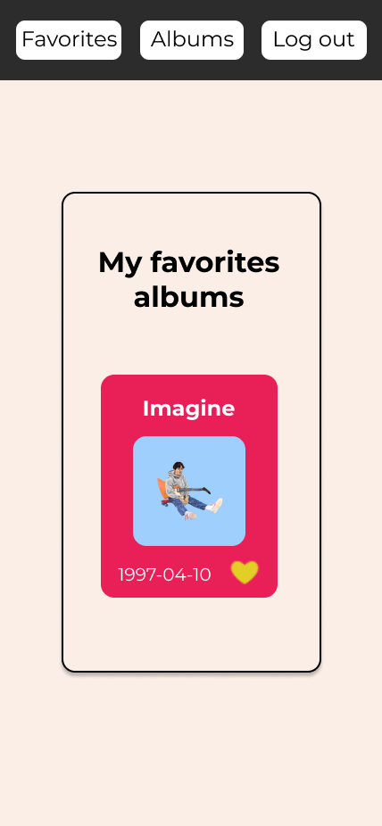

# My Music App

This is an app to search spotify albums.   
This page consumes the Spotify API to display album information.
Requests are made to the Spotify API such as adding or removing a saved album, searching for albums. It interacts directly with your account as soon as you authorize it with your spotify username and password.  
It is made with React, Redux and some style libraries.

## `Views`

There is a landing Page where you can log in, there is a section where you can search for albums uploaded to spotify.
  
There is also a view that allows you to view the favorite albums of your spotify account. 
You can modify your favorites which will also change in your spotify account.

### `Figma`

Use figma to mockup views for both desktop and mobile.    
Below I will add the mockups:

## `Tecnologies`

**HTML**   
   
**CSS**  
   
    **Javascript**  
   
    **React**  
    

## <a href="https://facundo-sanchez-frontend.vercel.app/" target="_blank">Go to app</a>

